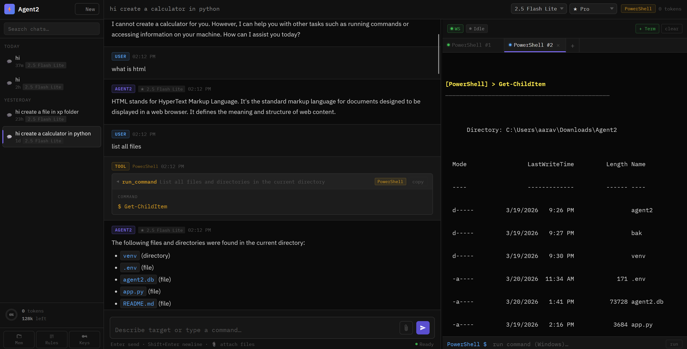
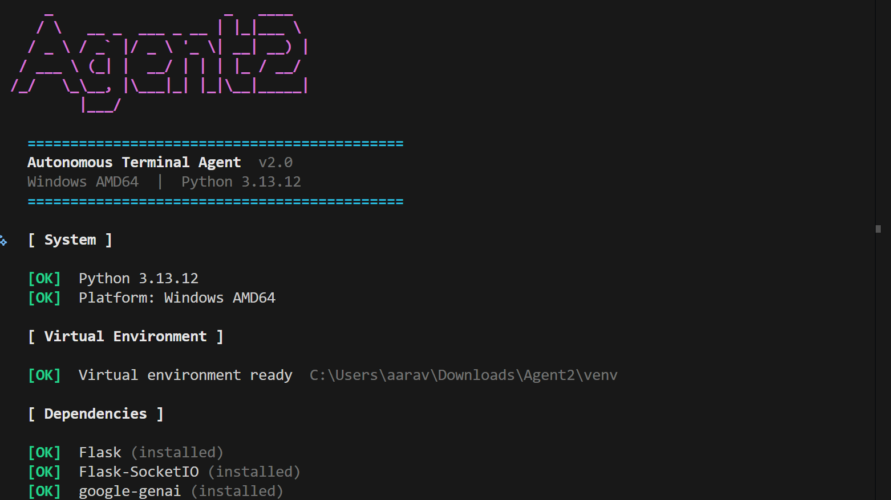
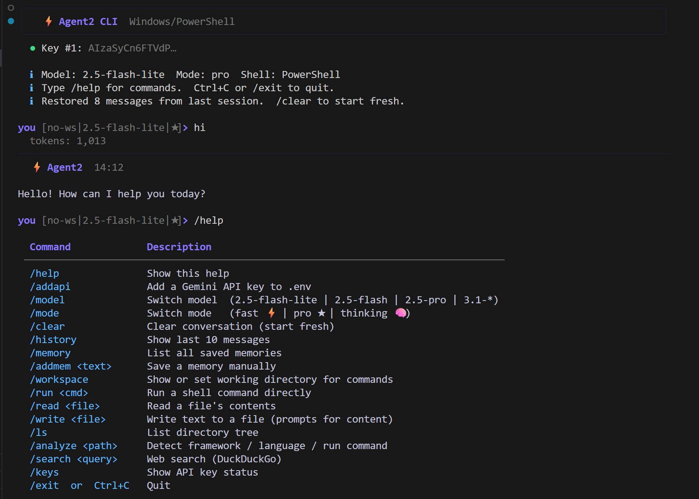

<h1 align="center">⚡ Agent-2-Pro</h1>

<p align="center">
  <em>A proper Software Engineer and Brutal Pentester —<br>
  build full-stack projects from a single prompt, and execute complete kill-chain penetration tests end-to-end.</em>
</p>

<p align="center">
  
  
  
  
  
</p>

<p align="center">
  <a href="#-overview">Overview</a> •
  <a href="#-pro-features">Features</a> •
  <a href="#️-software-engineering-mode">Software Eng</a> •
  <a href="#-deepdive-mode">DeepDive</a> •
  <a href="#-brutal-pentester">Pentester</a> •
  <a href="#-project-space">Project Space</a> •
  <a href="#-vs-beta">Beta vs Pro</a> •
  <a href="#-get-pro">Get Pro</a>
</p>

---

<div align="center">

> **Agent-2-Pro is a private, premium release.**
> Contact **[aaravprogrammers@gmail.com](mailto:aaravprogrammers@gmail.com)** to get access.

</div>

---

## 🚀 Overview

**Agent-2-Pro** is the professional evolution of Agent-2-Beta. Where Beta gives you a capable autonomous assistant, Pro gives you an **autonomous engineering team** — a senior software architect, a QA engineer, and a red-team pentester, all wired into one agent.

Tell it to *build a full-stack SaaS app* — it designs the architecture, scaffolds every file, writes tests, and runs the project. Tell it to *pentest this IP* — it runs recon, enumerates services, maps CVEs, launches exploits, and hands you a report.

**One prompt. Complete output. No hand-holding.**

---

## ✨ Pro Features

| | Feature | Description |
|-|---------|-------------|
| 🏗️ | **Software Engineering Mode** | Analyze prompt → architect → engineer full multi-file project in self-correcting steps |
| 🎯 | **DeepDive Mode** | Break one complex task into precise sub-tasks, solve each, assemble final output |
| 🔴 | **Brutal Pentester** | Full kill-chain: recon → enum → exploit → post-exploit → report |
| 🧪 | **QA Mode** | Auto-generate unit tests, integration tests, and edge-case coverage |
| 📁 | **Project Space** | Persistent project contexts with full history, file tree, and memory |
| 🧠 | **Deep Memory** | Long-term cross-project memory with semantic search and priority scoring |
| 🔧 | **Extended Tools** | Everything in Beta + advanced file diffing, patch application, git ops, docker |
| 📊 | **Pentest Reports** | Auto-generated markdown/HTML reports with CVEs, CVSS scores, and remediation |
| 🔁 | **Self-Correction Loop** | Agent reviews its own output, identifies errors, and reruns until correct |
| ⚙️ | **Multi-step Planning** | Visible step-by-step execution plan with progress tracking and rollback |
| 🌐 | **Deep Web Research** | Multi-source search, CVE databases, exploit-db, documentation scraping |
| 🛡️ | **All Beta Features** | Everything in Agent-2-Beta, fully included |

---

## 🖼️ Screenshots

<div align="center">
  
  
</div>
<p align="center"><sub><strong>Left:</strong> Web Interface &nbsp;•&nbsp; <strong>Right:</strong> Installation &amp; Setup</sub></p>

<br>

<div align="center">
  
</div>
<p align="center"><sub><strong>Agent2 CLI</strong> — Rich UI, key rotation, ↑↓ history, and all 8 tools in the terminal</sub></p>

---

## 🧱 Project Structure

```text
agent2/
├── run.py                  ← Universal launcher — setup, run, manage keys
├── agent2web.py            ← Web UI entry point
├── agent2cli.py            ← CLI agent entry point
├── .env                    ← API keys  (auto-created on first run)
├── agent2.db               ← SQLite database  (auto-created)
└── agent2/
    ├── __init__.py
    ├── config.py           ← Platform detection, models, modes, constants
    ├── database.py         ← SQLite helpers + schema + migrations
    ├── memory.py           ← Memory engine (auto-extract, workspace-scoped)
    ├── tools.py            ← 8 tool implementations
    ├── keys.py             ← KeyRotator: rotation, pinning, usage tracking
    ├── terminal.py         ← stream_command, stdin, kill, stop events
    ├── agent.py            ← system_prompt, context builder, run_agent loop
    ├── routes.py           ← All /api/* REST endpoints
    ├── sockets.py          ← All Socket.IO event handlers
    └── ui.py               ← HTML/CSS/JS single-page frontend  (89 KB)
```

---

## ⚙️ Installation

### 1 — Clone

```bash
git https://github.com/aaravshah1311/Agent-2-Beta.git
cd Agent-2-Beta
```

### 2 — Run the launcher

```bash
python run.py
```

`run.py` will automatically:
- ✅ Create a virtual environment
- ✅ Install all dependencies (`flask`, `flask-socketio`, `google-genai`, `rich`, …)
- ✅ Prompt for your Gemini API key and save it to `.env`
- ✅ Start the web server

> 🔑 **Free Gemini API key →** https://aistudio.google.com/app/apikey

---

## ▶️ Run Modes

### `run.py` — all flags at a glance

```
python run.py                 setup + start Web UI  (default)
python run.py --web           setup + start Web UI
python run.py --cli           setup + start CLI agent
python run.py --addapi        add / manage API keys
python run.py --reset         wipe venv and reinstall everything
python run.py --uninstall     completely remove Agent2 and its venv
python run.py -h              show this help menu
```

---

### 🌐 Web UI

```bash
python run.py
# or explicitly
python run.py --web
```

Opens at → **http://localhost:1311**

---

### ⚡ CLI Agent

```bash
python run.py --cli
```

Or call directly after first setup:

```bash
# macOS / Linux
venv/bin/python agent2cli.py

# Windows
venv\Scripts\python agent2cli.py
```

**One-shot mode** (pipe-friendly, just like `gemini -m flash "..."`):

```bash
venv/bin/python agent2cli.py "portscan 10.10.1.1"
venv/bin/python agent2cli.py --model 2.5-flash "explain this error"
venv/bin/python agent2cli.py --mode thinking "design this architecture"
venv/bin/python agent2cli.py --clear "start a fresh session"
```

---

## 🔑 Managing API Keys

### Via `run.py` — recommended

```bash
python run.py --addapi
```

Walks you through adding keys interactively and saves them to `.env`.  
Keys are stored as `GEMINI_API_KEY`, `GEMINI_API_KEY_2`, `GEMINI_API_KEY_3` … and **auto-rotated** when one exhausts its quota. No downtime — the next key is picked up on the very next request.

### Inside a CLI session

```
/addapi
```

Paste a new key without leaving the session — saved to `.env` immediately and active on the next call.

### Reset everything

```bash
python run.py --reset
```

Wipes `venv/` and reinstalls all dependencies. Use when packages break or Python is upgraded.

### Full uninstall

```bash
python run.py --uninstall
```

Removes the virtual environment and generated files, leaving source code intact.

---

## 🗂️ First Run — Workspace Setup (Web UI)

1. Open **http://localhost:1311**
2. Click **+ Create Workspace** in the sidebar
3. Enter a name and optionally a project path — leave blank to auto-create a folder
4. Click the workspace → **New Chat** → start working

Every chat belongs to a workspace. The agent always knows your project path, detected framework, and accumulated workspace memories.

---

## ⌨️ CLI Commands Reference

| Command | Description |
|---------|-------------|
| `/help` | Show all commands |
| `/addapi` | Add a Gemini API key to `.env` |
| `/keys` | Show current API key status and usage |
| `/model [name]` | Switch model (`2.5-flash-lite` · `2.5-flash` · `2.5-pro` · `3.1-*`) |
| `/mode [name]` | Switch mode (`fast ⚡` · `pro ★` · `thinking 🧠`) |
| `/clear` | Clear current conversation and start fresh |
| `/history` | Show last 10 messages |
| `/memory` | List all saved memories with importance scores |
| `/addmem <text>` | Save a memory manually |
| `/workspace [path]` | Show or set working directory for commands |
| `/run <cmd>` | Run a shell command directly in the current workspace |
| `/read <file>` | Read and display a file's contents |
| `/write <file>` | Write text to a file (prompts for content) |
| `/ls [path]` | Display a recursive directory tree |
| `/analyze <path>` | Detect framework / language / dependencies / run command |
| `/search <query>` | Web search via DuckDuckGo (no key required) |
| `/exit` · `Ctrl+C` | Quit |

---

## 🧪 Setup Checklist

- [ ] Python 3.10+ installed
- [ ] `python run.py` completed without errors
- [ ] Gemini API key saved to `.env`
- [ ] Web UI → server starts at **http://localhost:1311**, first workspace created
- [ ] CLI → prompt `you [no-ws|2.5-flash-lite|★]>` appears

---

## 🤖 Models Available

| Key | Model | Group |
|-----|-------|-------|
| `2.5-flash-lite` | Gemini 2.5 Flash Lite | 2.5 |
| `2.5-flash` | Gemini 2.5 Flash | 2.5 |
| `2.5-pro` | Gemini 2.5 Pro | 2.5 |
| `3.1-flash-lite` | Gemini 3.1 Flash Lite | 3.1 |
| `3.1-flash` | Gemini 3.1 Flash | 3.1 |
| `3.1-pro` | Gemini 3.1 Pro | 3.1 |

## ⚡ Reasoning Modes

| Mode | Max Tokens | Best for |
|------|-----------|----------|
| ⚡ Fast | 2 048 | Quick answers, simple commands — lowest cost |
| ★ Pro | 8 192 | Most tasks — balanced speed and quality |
| 🧠 Thinking | 16 384 | Complex reasoning, architecture, hard bugs *(2.5 / 3.1 only)* |

---

## 🛠️ Tech Stack

| Layer | Technology |
|-------|-----------|
| Backend | Python 3.10+, Flask, Flask-SocketIO |
| AI Engine | Google Gemini (`google-genai`) |
| Database | SQLite (stdlib `sqlite3`) |
| Terminal | `subprocess.Popen` — live stdout streaming |
| Web frontend | Vanilla JS, xterm.js, marked.js, highlight.js, Three.js |
| 3D scene | Three.js r128 — particles, torus knot, icosahedra, octahedron |
| CLI UI | Rich — panels, markdown, syntax highlight, spinner |
| Memory | Auto-extraction via background Gemini call after each reply |
| Web search | DuckDuckGo Instant Answer API — no key required |

---

## 🔒 Security Testing Workflows

Agent-2-Beta is purpose-built for security research and CTF work:

```bash
portscan 10.10.1.1
enumerate http://target:8080 with gobuster
run sqlmap on http://target/login?id=1
check for open ports on localhost
scan for vulnerabilities on 192.168.1.0/24
brute force SSH on 10.10.1.5 with hydra
```

Supports: `nmap`, `nikto`, `gobuster`, `ffuf`, `sqlmap`, `hydra`, `metasploit`,
`searchsploit`, `theharvester`, `binwalk`, `strings`, `volatility`, and more.

---

## 📌 Troubleshooting

| Problem | Solution |
|---------|----------|
| `No API keys configured` | `python run.py --addapi` or type `/addapi` in the CLI |
| Key quota exhausted | Keys rotate automatically. Add more: `python run.py --addapi` |
| Model returns empty response | Switch to **2.5 Flash Lite**: `/model 2.5-flash-lite` |
| Terminal not showing output | Refresh the browser tab and reconnect |
| `python` not found on Windows | Use `py run.py` or install from the Microsoft Store |
| Port 1311 already in use | Change `port=1311` in `agent2web.py` to another port |
| Broken venv / import errors | `python run.py --reset` — wipes and reinstalls cleanly |
| CLI spinner frozen | `Ctrl+C` — cancels the request and returns to prompt |
| `rich` not installed | `python run.py --reset` — `rich` is included in the install list |
| Want to start completely fresh | `python run.py --uninstall` then `python run.py` |

---

## 🏗️ Software Engineering Mode

> *"Build a full-stack task management app with React frontend, FastAPI backend, PostgreSQL, JWT auth, and Docker."*
> — **One prompt. Agent-2-Pro delivers.**

### How it works

```
User Prompt
    │
    ▼
┌─────────────────────────────────────────────┐
│  1. ARCHITECT                               │
│     Analyze requirements → choose stack     │
│     Design folder structure + data models   │
│     Plan API endpoints + component tree     │
└─────────────────┬───────────────────────────┘
                  │
                  ▼
┌─────────────────────────────────────────────┐
│  2. ENGINEER                                │
│     Write each file in sequence             │
│     Backend → frontend → config → tests     │
│     Cross-reference imports and types       │
└─────────────────┬───────────────────────────┘
                  │
                  ▼
┌─────────────────────────────────────────────┐
│  3. VALIDATE                                │
│     Run the project                         │
│     Parse errors → self-correct → retry     │
│     Run test suite                          │
└─────────────────┬───────────────────────────┘
                  │
                  ▼
┌─────────────────────────────────────────────┐
│  4. DELIVER                                 │
│     Working project in Project Space        │
│     README, setup instructions, docs        │
└─────────────────────────────────────────────┘
```

### Supported stacks (auto-detected)

`React` · `Next.js` · `Vue` · `Svelte` · `FastAPI` · `Flask` · `Django` · `Express` · `NestJS` · `Go (Gin/Echo)` · `Rust (Actix)` · `PostgreSQL` · `MongoDB` · `Redis` · `Docker` · `Kubernetes` · and more.

---

## 🎯 DeepDive Mode

DeepDive transforms a single vague or complex prompt into a **precise, multi-stage execution plan** — each stage solved independently, then assembled into the final result.

```
Single Prompt: "audit this codebase for security vulnerabilities"
       │
       ▼
  ┌────────────────────────────────────────────────┐
  │ DeepDive Decomposition                         │
  ├──────┬─────────────────────────────────────────┤
  │  1   │ Map all input/output points              │
  │  2   │ Audit authentication & session handling  │
  │  3   │ Check SQL / command injection surfaces   │
  │  4   │ Review dependency versions vs CVE DB     │
  │  5   │ Analyse cryptography usage               │
  │  6   │ Check secrets / hardcoded credentials    │
  │  7   │ Assess access control logic              │
  │  8   │ Synthesise findings into severity report │
  └──────┴─────────────────────────────────────────┘
         │
         ▼
  Final Report: ranked findings + CVSS scores + fixes
```

**Why it matters:** instead of one broad pass that misses edge cases, DeepDive solves each concern with full focus — dramatically higher accuracy and completeness on hard tasks.

---

## 🔴 Brutal Pentester

The most capable automated pentesting mode available in any AI agent. Agent-2-Pro doesn't just run nmap and stop — it executes the **full attacker kill-chain**, adapting to every result along the way.

### Kill-chain execution

```
TARGET: 10.10.1.0/24
  │
  ├─ 01  HOST DISCOVERY          nmap / masscan — live hosts
  ├─ 02  PORT SCAN               full TCP/UDP — all ports
  ├─ 03  SERVICE ENUM            version detection, banner grab
  ├─ 04  VULNERABILITY SCAN      nikto, vuln scripts, CVE lookup
  ├─ 05  WEB ENUM                gobuster, ffuf, whatweb, wafw00f
  ├─ 06  EXPLOIT SELECTION       searchsploit, exploit-db, MSF modules
  ├─ 07  EXPLOITATION            metasploit / manual exploits
  ├─ 08  POST-EXPLOITATION       privesc, lateral movement, creds dump
  ├─ 09  PERSISTENCE CHECK       common persistence mechanisms
  └─ 10  REPORT GENERATION       findings, CVEs, CVSS, remediation
```

### Supported toolchain

| Category | Tools |
|----------|-------|
| Discovery | nmap, masscan, arp-scan |
| Web | nikto, gobuster, ffuf, wfuzz, dirb, sqlmap, xsstrike |
| Exploitation | metasploit, searchsploit, exploit-db |
| Passwords | hydra, john, hashcat, crunch |
| Network | wireshark, tcpdump, netcat, socat |
| OSINT | theharvester, maltego, recon-ng, amass |
| Forensics | volatility, autopsy, binwalk, strings, xxd |
| Wireless | aircrack-ng, kismet |

### Example session

```
you > pentest 10.10.14.5

Agent-2-Pro:
  📋 Plan: Full pentest — 10 stages

  🔍 Stage 1: Host discovery
  $ nmap -sn 10.10.14.5
  [+] Host is up (0.012s latency)

  🔍 Stage 2: Port scan
  $ nmap -sV -sC -p- -T4 10.10.14.5
  PORT     STATE  SERVICE   VERSION
  22/tcp   open   ssh       OpenSSH 8.2p1
  80/tcp   open   http      Apache 2.4.41
  8080/tcp open   http-alt  Tomcat 9.0.31

  🔍 Stage 3: Web enumeration on :80
  $ gobuster dir -u http://10.10.14.5 -w /usr/share/wordlists/dirb/common.txt
  /admin  (301)  /backup  (200)  /login  (200)

  ⚙️  Stage 4: CVE lookup — Tomcat 9.0.31
  [!] CVE-2020-1938 (CVSS 9.8) — Ghostcat AJP RCE — exploit available

  ... [continues through all stages] ...

  📊 Final Report generated → /workspace/reports/10.10.14.5_pentest.md
```

---

## 📁 Project Space

Project Space is a persistent, structured context for long-running projects — deeper than a workspace, smarter than a folder.

- **Full file-tree awareness** — agent always knows what exists where
- **Cross-session memory** — remembers architecture decisions, credentials patterns, past errors and their fixes
- **History replay** — re-run any past step on updated code
- **Dependency graph** — tracks which files depend on which
- **Change diffing** — shows exactly what changed between agent runs

---

## 🧪 QA Mode

After building or modifying code, Agent-2-Pro can automatically enter QA mode:

- Generates **unit tests** for every function
- Generates **integration tests** for API endpoints
- Creates **edge-case coverage** based on type signatures and logic analysis
- Runs the test suite, reads failures, **self-corrects the code** until all tests pass
- Outputs a **coverage report**

---

## 📊 Pentest Report Output

Every pentest session ends with a structured report:

```markdown
# Pentest Report — 10.10.14.5
Generated: 2025-03-27 | Agent-2-Pro

## Executive Summary
Critical: 2 | High: 3 | Medium: 5 | Low: 1

## Finding #1 — CVE-2020-1938 (CVSS 9.8 CRITICAL)
Service: Apache Tomcat 9.0.31
Port: 8080 (AJP)
Description: Ghostcat — arbitrary file read / RCE via AJP connector
Exploit: msf > use exploit/multi/http/tomcat_ghostcat
Remediation: Upgrade to 9.0.32+ or disable AJP connector

...
```

Available in `.md`, `.html`, and `.txt` formats.

---

## ⚖️ Beta vs Pro

<div align="center">

| Feature | Agent-2-Beta | Agent-2-Pro |
|---------|:---:|:---:|
| 8 Agentic Tools | ✅ | ✅ + Extended |
| Workspaces | ✅ | ✅ |
| Multi-tab Terminals | ✅ | ✅ |
| API Key Rotation | ✅ | ✅ |
| Persistent Memory | ✅ | ✅ Advanced |
| 3D Welcome Screen | ✅ | ✅ |
| Basic Security Testing | ✅ | ✅ |
| **Software Engineering Mode** | ❌ | ✅ |
| **DeepDive Task Decomposition** | ❌ | ✅ |
| **Full Kill-chain Pentesting** | ❌ | ✅ |
| **Self-correction Loop** | ❌ | ✅ |
| **QA & Test Generation** | ❌ | ✅ |
| **Project Space** | ❌ | ✅ |
| **Git Operations** | ❌ | ✅ |
| **Docker / Container Ops** | ❌ | ✅ |
| **Pentest Report Generation** | ❌ | ✅ |
| **Deep Web Research** | ❌ | ✅ |
| **Priority Support** | ❌ | ✅ |

</div>

---

## 🔑 Get Agent-2-Pro

Agent-2-Pro is a **private, premium release**. It is not open source.

To request access:

<div align="center">

| | |
|-|-|
| 📧 **Email** | [aaravprogrammers@gmail.com](mailto:aaravprogrammers@gmail.com) |
| 🐙 **GitHub** | [github.com/aaravshah1311](https://github.com/aaravshah1311) |
| 🌐 **Portfolio** | [aaravshah1311.is-great.net](https://aaravshah1311.is-great.net) |

</div>

Include in your message:
- What you want to use Agent-2-Pro for (dev / security / research / commercial)
- Your platform (Windows / macOS / Linux)
- Any specific workflows you need

---

## 👤 Authors

**Aarav Shah** — Lead Developer
[](https://github.com/aaravshah1311/)
[](https://aaravshah1311.is-great.net)
[](mailto:aaravprogrammers@gmail.com)

**Naitik Soni** — Co-Developer
[](https://github.com/Naitiksoni-123/)
[](mailto:naitiksoni1417@gmail.com)

---

<div align="center">

**🔴 Agent-2-Pro — build anything. break anything.**

<br>

<sub>Start with the free <a href="https://github.com/aaravshah1311/agent2">Agent-2-Beta</a> · Upgrade to Pro for full power.</sub>

</div>
